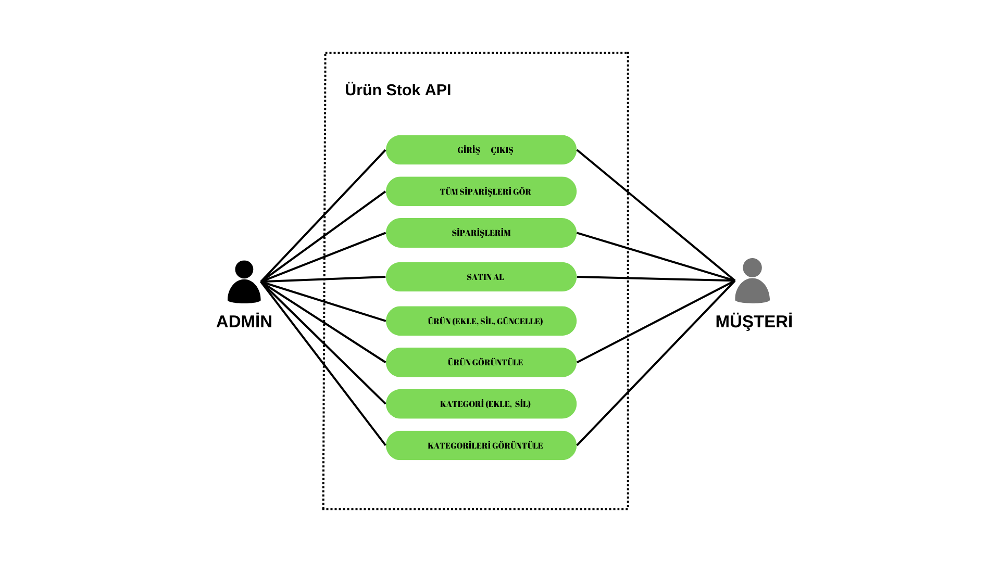

# Ürün Stok API
StokAPI, basit bir stok yönetim API'si sunan Flask tabanlı bir web uygulamasıdır.
Günümüzde işletmeler satış işlemlerini arttırmak için daha geniş bir müşteri pazarına ulaşabilmek ve rekabetçi pazarda ayakta kalabilmek adına işletmelerini internet ortamına taşımaktadır. Ürün stok API'si, bir e-ticaret altyapısında veya stok yönetimi gerektiren herhangi bir projede kullanılabilen önemli bir bileşendir. Bu API'nin amacı, kullanıcıların ürün stokları hakkında bilgi almasını veya stokları güncellemesini sağlamaktır.

## İçerikler
- [Özellikler](#Özellikler)
- [Kullanıcı Durum Diyagramı](#Kullanıcı-Durum-Diyagramı)
- [Kullanılan Teknolojiler](#Kullanılan-Teknolojiler)
- [Kurulum](#Kurulum)
- [Test](#Test)

## Özellikler
- Kategorilere ve ürünlere erişim sağlar.
- Ürün ekleme, güncelleme ve silme işlemlerini destekler.
- Sipariş oluşturma ve siparişleri listeleme özellikleri vardır.
- Kullanıcı yetkilendirme ve oturum yönetimi sağlar.

## Kullanıcı Durum Diyagramı

## Kullanılan Teknolojiler
-Python: Proje, Python programlama dilinde yazılmıştır.

-Flask: Flask, Python tabanlı bir web framework'üdür ve bu projede kullanılarak API'lerin oluşturulması sağlanmıştır.

-Flask-CORS: Flask uygulamasında Cross-Origin Resource Sharing (CORS) desteği sağlar ve bu projede CORS ayarlarını kolaylaştırmak için kullanılmıştır.

-Flask-JWT-Extended: Flask uygulamasında JSON Web Token (JWT) tabanlı kimlik doğrulama ve yetkilendirme işlemlerini sağlar.

-SQLAlchemy: SQLAlchemy, Python için bir ORM (Object-Relational Mapping) aracıdır ve bu projede veritabanı işlemleri için kullanılmıştır. 

-smtplib: Python ile e-posta göndermek için kullanılan bir kütüphanedir.

### Kurulum 
1. Bu depoyu klonlayın: git clone https://github.com/Serhat-Karatas/Urun-Stok-API-Flask.git

2. Proje dizinine gidin: cd stok-api

3. Sanal bir ortam oluşturun ve etkinleştirin:

   python3 -m venv venv
   
   source venv/bin/activate

4. Gerekli bağımlılıkları yükleyin: pip install -r requirements.txt

5. Veritabanını oluştur ve bağlantı bilgilerini "__init__.py" içerisine yazın. Projeyi çalıştırdığında veritabanı tabloları ve ilişkileri otomatik oluşturulacaktır.

6. Projeyi çalıştırın.

## Test
API'leri test etmek için Postman aracını kullanabilirsiniz.
